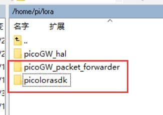

# picolorasdk
Scripts and files for LoRa pico gateway produced by Heltec automation(TM). This file should work with raspberry pi.

## install
- connect HT-M01 to raspberry Pi via USB;
- clone this project into raspberry pi, and picolorasdk and picoGW_packet_forwarder should in a same folder. e.g. 


  ```bash
  cd /home/pi
  mkdir lora
  
  cd /home/pi/lora
  git clone https://github.com/Lora-net/picoGW_hal.git
  cd /home/pi/lora/picoGW_hal
  make clean all
  
  cd /home/pi/lora
  git clone https://github.com/Lora-net/picoGW_packet_forwarder.git
  cd /home/pi/lora/picoGW_packet_forwarder/
  make clean all
  
  cd /home/pi/lora
  git clone https://github.com/HelTecAutomation/picolorasdk.git
  cd /home/pi/lora/picolorasdk
  chmod +x install.sh
  ./install.sh
  ```
